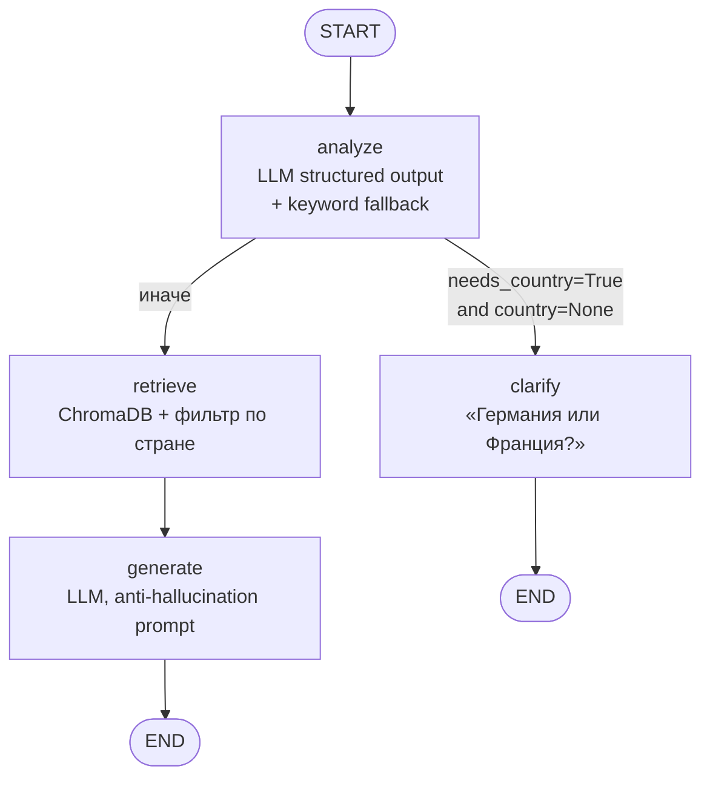

# CdekStart — контекстный RAG-агент на LangGraph

Чат-бот, консультирующий по правилам международной стажировки **CdekStart**.
Поддерживает диалог, задаёт уточняющие вопросы при неоднозначных запросах
(например, не указана страна) и **никогда не выдумывает** ответы — только
то, что есть в базе знаний.

> Тестовое задание на позицию стажёра LLM Engineer.

---

## TL;DR — запуск одной командой

```bash
docker-compose up --build
```

Никаких ключей, никаких `.env`, никаких ручных шагов. Всё поднимается
из коробки: локальный Ollama-сервис, скачивание модели Qwen2.5:3b,
индексация базы знаний, FastAPI на `http://localhost:8000`.

> **Первый запуск** ~5–7 минут (скачивание ~1.9 GB модели). Все
> последующие запуски — секунды (модель и индекс кэшируются в Docker
> volumes).

После старта:

```bash
# Уточняющий вопрос — страна не указана
curl -X POST http://localhost:8000/chat \
  -H 'Content-Type: application/json' \
  -d '{"session_id":"u1","message":"Какая стипендия?"}'
# -> {"type":"clarification","answer":"Уточните: Германия или Франция?",...}

# Бот помнит контекст сессии
curl -X POST http://localhost:8000/chat \
  -H 'Content-Type: application/json' \
  -d '{"session_id":"u1","message":"Германия"}'
# -> {"type":"answer","answer":"В Германии стипендия 1200 евро в месяц.",...}
```

Swagger UI: `http://localhost:8000/docs`.

---

## Содержание

1. [Что делает агент](#что-делает-агент)
2. [Архитектура](#архитектура)
3. [Граф LangGraph](#граф-langgraph)
4. [Обоснование выбора стека](#обоснование-выбора-стека)
5. [Особенности и ограничения](#особенности-и-ограничения)
6. [Смена LLM-провайдера](#смена-llm-провайдера)
7. [API](#api)
8. [Тесты](#тесты)
9. [Структура репозитория](#структура-репозитория)

---

## Что делает агент

* Отвечает на вопросы по программе стажировки на основе **5 файлов
  в `data/`** (общая информация, дедлайны, льготы, правила Германии,
  правила Франции).
* **Поддерживает контекст диалога** через `session_id`: помнит
  предыдущие реплики и упомянутую страну.
* **Задаёт уточняющий вопрос**, если запрос требует страны (стипендия,
  налог, виза, рабочий день), а страна не указана.
* **Не галлюцинирует**: при отсутствии ответа в базе честно отвечает
  «В моей базе знаний нет ответа…».
* **Фильтрует выдачу по стране**: запрос с `country=germany` не получит
  данных Франции — это критично для двух почти-идентичных по структуре
  файлов (`germany_rules.txt` vs `france_rules.txt`).

---

## Архитектура

```
HTTP POST /chat
   ↓
FastAPI (app/main.py)
   ↓
SessionMemory ──► восстанавливает messages + country по session_id
   ↓
LangGraph (app/graph/) ──► узлы: analyze → [clarify | retrieve+generate]
   │
   ├── analyze: LLM (structured output) + keyword-fallback
   │            определяет нужна ли страна, какая указана
   ├── clarify: LLM формулирует уточняющий вопрос
   ├── retrieve: ChromaDB + multilingual-эмбеддинги (фильтр по стране)
   └── generate: LLM отвечает СТРОГО по контексту
   ↓
Возвращается ответ + тип (answer | clarification | refusal) + источники
```

Ключевые принципы:

* **Провайдер-агностичность LLM** — `app/llm/factory.py` строит модель
  по переменной окружения `LLM_PROVIDER` (`ollama` / `openai` /
  `anthropic`). Остальной код видит только интерфейс `BaseChatModel`.
* **Чистые зависимости** — узлы графа принимают `llm` и `kb`
  параметрами, легко подменяются стабами в тестах.
* **Persistent state** — ChromaDB, кэш моделей и Ollama пишут на
  Docker volumes. Никаких повторных скачиваний между запусками.
* **Двойная защита от галлюцинаций** — фильтрация по стране на
  этапе ретривала + строгий system-prompt на этапе генерации +
  refusal при пустом контексте.

---

## Граф LangGraph



**Состояние** (`app/graph/state.py`):

| Поле | Тип | Назначение |
|---|---|---|
| `messages` | `list[BaseMessage]` | История диалога (мерджится через `add_messages`) |
| `query` | `str` | Извлечённый последний вопрос пользователя |
| `country` | `str \| None` | `germany` / `france` / `None`. Наследуется из памяти сессии |
| `needs_country` | `bool` | Решение узла `analyze` |
| `retrieved` | `list[RetrievedChunk]` | Найденные чанки |
| `answer` | `str` | Готовый ответ |
| `answer_type` | `Literal["answer","clarification","refusal"]` | Тип ответа в API |

**Anti-hallucination на трёх уровнях:**

1. На этапе **retrieval** — фильтр по `country`, чтобы данные Франции не
   попали в ответ про Германию.
2. На этапе **generation** — system prompt запрещает домысливать
   («НИКОГДА не выдумывай факты, цифры, даты»); при пустом контексте
   модель вообще не вызывается, возвращается шаблонный refusal.
3. На этапе **post-processing** — простая эвристика помечает ответы
   с фразами «нет ответа / нет в базе» как `refusal` для UI/аналитики.

**Robustness через keyword-fallback в analyze:**

Если LLM не справилась со structured output (типичная проблема мелких
локальных моделей), узел `analyze` переключается на детерминированный
keyword-detector: ищет в тексте «герман/берлин» → `germany`, «франц/париж`
→ `france`, и набор стран-зависимых терминов («стипенди», «налог»,
«виза», ...) → `needs_country=True`. Это гарантирует, что clarify-сценарий
работает даже на 1.5B-моделях.

---

## Обоснование выбора стека

### LLM по умолчанию: **Ollama + Qwen2.5:3b** (локально, без секретов)

| Критерий | Аргумент |
|---|---|
| Запуск одной командой | не нужен API-ключ, нет внешних зависимостей |
| Качество для русского | Qwen2.5 — лучшая мультиязычная модель в своей весовой категории |
| Размер модели | ~1.9 GB — приемлемо для одноразового скачивания |
| Structured output | Qwen2.5 нативно поддерживает JSON-schema; для сбоев есть keyword-fallback |
| Скорость | ~5–10s на запрос на CPU; сильно быстрее на GPU |
| Безопасность | данные не покидают контейнер, ноль секретов в репо |

**Почему не сразу gpt-4o-mini?** Задание требует, чтобы проект запускался
**одной командой** `docker-compose up --build`. Любая облачная LLM
требует API-ключа → обязательный шаг настройки → нарушение требования.
Архитектура остаётся **провайдер-агностичной**: переключение на OpenAI —
одна правка `.env` (см. ниже).

### Эмбеддинги: **локальные `sentence-transformers/paraphrase-multilingual-MiniLM-L12-v2`**

| Критерий | Аргумент |
|---|---|
| Стоимость | бесплатно, без API-ключа |
| Русский | multilingual-модель, хорошо отделяет страновые документы |
| Размер | ~120 МБ, кэшируется в Docker volume |
| Качество для маленькой KB | избыточно достаточно |

### Векторное хранилище: **ChromaDB (persistent client)**

| Критерий | Аргумент |
|---|---|
| Простота | embedded mode, без отдельного сервиса |
| Метаданные + фильтры | `where={"country": {"$in": [...]}}` — ключевой механизм против галлюцинаций |
| Persistent | пишет на Docker volume `chroma-data` |

### LangGraph

Multi-step логика с условными переходами выражается явно как state
machine. Узлы — чистые функции, легко тестируются. State визуализируется
(см. диаграмму).

### Чанкинг: **«один файл — один чанк»**

Файлы крошечные (~200 символов каждый). Дробление по строкам потеряло
бы контекст («Налог: 15%» без указания страны). При `top_k=4` LLM
получает до 4 целых файлов — вписывается в context window любой
современной модели.

---

## Особенности и ограничения

(пункт 4.5 задания: «если есть особенности или ограничения в использовании
моделей — описать в README»)

* **Время первого запуска ~5–7 минут.** Docker качает модель Ollama
  (1.9 GB). Все последующие запуски — секунды (volume `ollama-data`
  кэширует модель на диске).

* **Ресурсы.** Qwen2.5:3b на CPU требует ~3 GB RAM. На слабых машинах
  ответы LLM могут идти 5–15 секунд. Для production-настройки рекомендую
  переключиться на gpt-4o-mini (см. ниже) или поднять Ollama на GPU.

* **Structured output на маленьких локальных моделях.** Qwen2.5:3b
  обычно справляется, но 3B-модели иногда возвращают невалидный JSON.
  Узел `analyze` обрабатывает это через keyword-fallback — clarify-
  сценарий и фильтрация по стране продолжают работать корректно.
  Покрыто отдельными тестами.

* **In-memory сессии.** Состояние диалогов теряется при рестарте API.
  Для production достаточно подменить `SessionMemory` на Redis-обёртку
  (интерфейс уже изолирован).

* **Без аутентификации.** Задание не требовало; добавляется одним
  middleware FastAPI.

---

## Смена LLM-провайдера

Архитектура полностью провайдер-агностична. Чтобы переключиться на
**OpenAI** (выше качество, особенно на сложных формулировках):

```bash
# 1. Создать .env
cat > .env <<'EOF'
LLM_PROVIDER=openai
LLM_MODEL=gpt-4o-mini
OPENAI_API_KEY=sk-...
EOF

# 2. Перезапустить
docker-compose up --build
```

Поддерживаются также `anthropic` (см. `.env.example`). Контейнер
ollama при этом продолжит работать вхолостую — если хотите, его можно
выключить точечно:

```bash
docker-compose up --build api
```

---

## API

### `POST /chat`

```jsonc
// Request
{
  "session_id": "u-42",
  "message": "Какая стипендия?"
}

// Response — три возможных типа:

// 1) answer — ответ найден в базе
{
  "session_id": "u-42",
  "type": "answer",
  "answer": "В Германии стипендия 1200 евро в месяц...",
  "sources": [{"source": "germany_rules.txt", "score": 0.91}]
}

// 2) clarification — нужен страновой контекст
{
  "session_id": "u-42",
  "type": "clarification",
  "answer": "Уточните: Германия (Берлин) или Франция (Париж)?",
  "sources": []
}

// 3) refusal — ответа в базе нет
{
  "session_id": "u-42",
  "type": "refusal",
  "answer": "В моей базе знаний нет ответа...",
  "sources": []
}
```

### `DELETE /chat/{session_id}`
Сбросить сессию (полезно для тестов и кнопки «начать заново»).

### `GET /health`
Простой liveness + число проиндексированных документов.

### Swagger UI
`http://localhost:8000/docs`.

---

## Тесты

```bash
pytest -q
```

Покрытие (16 тестов):

| Файл | Что проверяет |
|---|---|
| `tests/test_retriever.py` | Индексация всех 5 файлов, фильтр по стране, идемпотентность |
| `tests/test_graph.py` | Уточняющий вопрос; retrieve+generate; **наследование страны из истории**; refusal при пустом retrieval; общий вопрос; **keyword-fallback при сбое structured output** |
| `tests/test_api.py` | Healthcheck; E2E «уточнили → ответили»; валидация Pydantic; **изоляция сессий** между разными `session_id` |

В тестах используются `FakeChatLLM` и `FakeKB` — тесты гоняются за
секунду без сети и без модели. CI workflow в `.github/workflows/ci.yml`.

---

## Структура репозитория

```
.
├── app/
│   ├── main.py             # FastAPI: /chat, /health, lifespan
│   ├── config.py           # Pydantic Settings
│   ├── schemas.py          # Pydantic models для API
│   ├── llm/factory.py      # провайдер-агностичная фабрика LLM
│   ├── rag/
│   │   ├── ingest.py       # маппинг файл → метаданные
│   │   ├── embeddings.py   # sentence-transformers loader
│   │   └── retriever.py    # ChromaDB wrapper с фильтром по стране
│   ├── graph/
│   │   ├── state.py        # AgentState (TypedDict)
│   │   ├── nodes.py        # analyze / clarify / retrieve / generate
│   │   └── builder.py      # сборка LangGraph
│   └── memory/store.py     # in-memory сессии (заменимо на Redis)
├── data/                   # 5 файлов базы знаний
├── tests/                  # pytest: retriever / graph / api
├── scripts/ingest.py       # CLI для пере-индексации
├── docker-compose.yml      # ollama + ollama-pull + api
├── Dockerfile              # multi-stage, non-root user
├── requirements.txt
├── pyproject.toml          # настройки pytest и ruff
├── .env.example            # необязательно — для смены LLM
└── .github/workflows/ci.yml
```

---

## Лицензия / контакты

Тестовое задание для CDEK. 
Автор — Музраев Тимур, 
кандидат на стажировку, студент МИЭМ НИУ ВШЭ.

